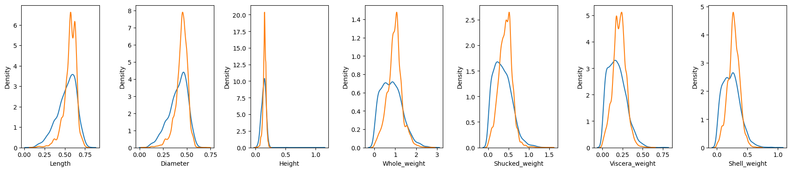

I came across an article (1) titled 'Language Models are Realistic Tabular Data 
Generators' which argues just that. The process is something like

1. Convert your tabular data into sentences;
2. Fine tune a large language model on those sentences; 
3. Ask it to generate new ones.

I found this fairly interesting and decided to test the process. I might have set 
my expectations too high but I got really excited about the idea of a language model
as a data-augmentation strategy.  The authors have also made their code open source 
and the API is pretty straightforward. 

For my experiment I loaded the abalone dataset, which contains the sex and spatial and weight
measurements of ~4000 snails. 1000 samples are set aside for validation data (although as 
we never even get to use it.)

```python
data = fetch_openml(name='abalone', version=1, parser="auto")
x = data.data
x['Sex'] = x['Sex'].astype('category').cat.codes # label encoding.
y = data.target.astype(float)
data = x
data['Rings'] = y
data_train, data_test = train_test_split(data, train_size=3000, random_state=420)
```

The plan is to train and validate a regression model on the original data, then on 
a dataset containing the original 3000 samples augmented by the same number of synthetic
samples. Hopefully the model trained on the extra data will have greater predictive power
on unseen data.  As mentioned, the API is simple:

```python
great = be_great.GReaT("distilgpt2",
                       epochs=30, 
                       save_steps=2000,
                       logging_steps=500,
                       experiment_dir="trainer_abalone",
                       batch_size=16)
trainer = great.fit(data_train)
synthetic_data = great.sample(3000)
```

Unfortunately the univariate densities are pretty terrible imitations of the
originals though, so bad that I'm calling it quits here. Maybe a larger model 
would do better but actually now I think I must have been dreaming if I thought
this could be used for meaningful data augmentation!



Even though this didn't really work it's been fun to play with an experimental
library and maybe it could be useful for other things, like generating a big
dataset for development purposes before the real one becomes available.


Refs:
1. https://openreview.net/pdf?id=cEygmQNOeI