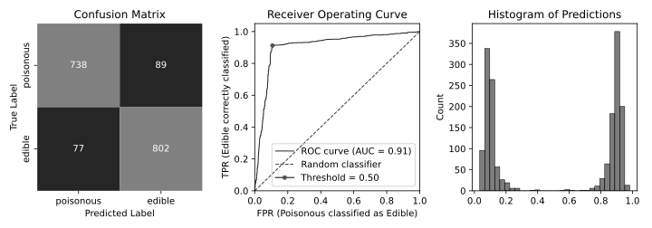
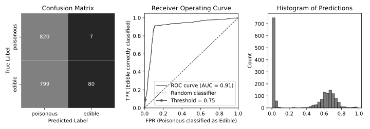

+++
title = 'Mushrooms'
date = 2025-02-23T11:18:24+11:00
draft = false
math = true
tags = ["data-science", "error-rates"]
+++


**Disclaimer: Do NOT use anything you find in here to help you choose a mushroom!**

<!-- *Source code: ???* -->

This notebook explores the tradeoff between type 1 (false positive) and type 2 (false negative) errors.
In this example, we are attempting to determine whether a given mushroom is edible. In this context a *false positive* is a deadly mushroom classified as edible (BAD!) and a false negative is is an edible mushroom classified as poisonous (a shame, but ok).

For what follows, suppose we determine (unrealistically!) that we are OK if 1 out of every 100
mushrooms that we eat is poisonous. This is mental, but it's the kind of constraint that has to
come from outside the modelling process and so the exact value is not our concern here.
To be explicit, we are tying to build the best model that has a **false positive rate (type 1 error rate) of 1% or less**.


As we will see, the data are too easy and an untuned decision tree is able to achieve
perfect accuracy on unseen data. The function below loads the data and flips the labels
of a given proportion of samples to make the problem more difficult.


```python
def load_data(noise_level):
    path = kagglehub.dataset_download("uciml/mushroom-classification")
    df = pd.read_csv(os.path.join(path, "mushrooms.csv"))
    assert df.isna().sum().sum() == 0
    assert set(df['class']) == {'e', 'p'}
    df['class'] = (df['class'] == 'e').astype(int)

    if noise_level > 0:
        # Polute the data to make the problem harder.
        mask = np.random.random(len(df)) < noise_level
        df.loc[mask, 'class'] = 1 - df.loc[mask, 'class']

    train, test = train_test_split(df, train_size=0.7)
    train, valid = train_test_split(train, train_size=0.7)
    return train, valid, test
```

## The Data
The data contain many qualitative features of mushrooms, which will need to be one hot encoded for
the models that we are building. A few of the features are listed below.

| Attribute | Values |
|----------------------------------|--------------------------------------------------------------------------------------------|
| Cap Shape | bell (b), conical (c), convex (x), flat (f), knobbed (k), sunken (s) |
| Cap Surface | fibrous (f), grooves (g), scaly (y), smooth (s) |
| Cap Color | brown (n), buff (b), cinnamon (c), ... |
| Bruises | bruises (t), no (f) |

We define a reusable pipeline generator that takes the data and a base classifier and returns
a trainable object that also encodes the input features.
We can use this pipeline to show that the original dataset is too easy.
If we train an untuned decision tree we can achive perfect accuracy on unseen data:


```python
def no_noise():
    """
    Train a decision tree classifier and return prediction accuracy on
    the validation set.
    """
    df, df_valid, _ = load_data(noise_level=0)
    pipe = make_pipeline(df, DecisionTreeClassifier())
    y_hat = pipe.predict(df_valid.drop('class', axis=1))
    return np.mean(y_hat == df_valid['class'])

no_noise()
```

    np.float64(1.0)

To make the problem harder, fix the noise level at 0.1 and split off training,
validation and final test data sets.

```python
df_train, df_valid, df_test = load_data(0.1)
```


## Baseline
As a baseline model, we can take a simple logistic regression and see how it goes.
Note that the point here is not to get the absolute best model, but to experiment
with type 1 and type 2 error rates.

In this version, if the model thinks that a mushroom is more than 50% likely to be
poisonous then it will classify it as such. This model does not achieve the required
false positive rate, but it's a useful start to put things in context.


```python
def model_baseline():
    model = make_pipeline(df_train, LogisticRegression())
    _, axs = plt.subplots(ncols=3, nrows=1, figsize=(10, 3.5))

    threshold = 0.5
    plot_confusion(model, df_valid, threshold, ax=axs[0])
    plot_roc(model, df_valid, threshold, axs[1])
    plot_prediction_histogram(model, df_valid, axs[2])

    plt.tight_layout(pad=1)
    plt.show()

model_baseline()
```





## Tighter Decision Threshold
The first strategy to try is to make the decision threshold more and more conservative
until we achieve the desired false positive rate. The following code shows that if we
eat a mushroom only if we are $93\\%$ sure that it's safe (as opposed to any number greater
than $50\\%$) then we achieve our desired $1\\%$ false positive rate and end up with $63$ edible
mushrooms.


## Class Weights
A second strategy would be to increase the penalty during training of a
poisonous mushroom being incorrectly classified (as edible). In scikit
learn this is relatively easy to implement.  The main problem with this
approach is that it's hard to say what the right ratio of penalties should
be for misclassifying a poisonous or edible mushroom.  The ratio is fed into
the training routine of the model, which will vary as we try different model
families. This makes it a very difficult parameter to interpret.
Nevertheless, let's pick a cost ratio of $5$ out of nowhere.
The optimal decision threshold int his case is around $75\\%$
and, importantly, this idea gives us **more edible mushrooms!**




## Optimal Cost Ratio

As a last try we can adjust the cost ratio used during training dynamically to
find the one that will give us the desired false positive rate.
For a bit of extra work (a binary search for the the right cost ratio) you get the
same results as the previous method. In particular the model uses a cost ratio
of $14$.


## Recap
To recap, we wanted to find a model that only has a very small chance of killing us
with a dodgy mushroom. We tried three methods to modify the base model:
1. Tighten the decision threshold;
2. Penalise false positives during training more harshly, and then do the same;
3. Dynamically choose a cost ratio.

The latter two got the best results, but the second method did so with the least work.
