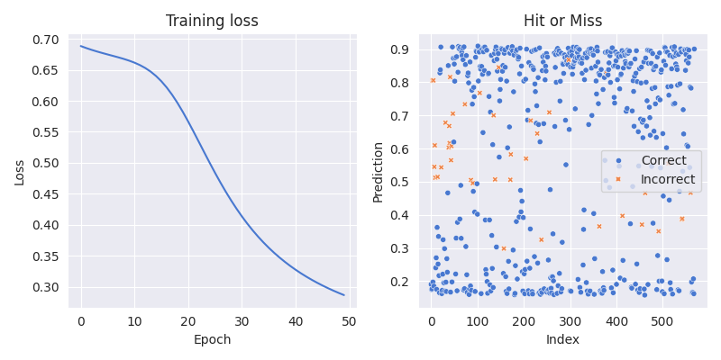
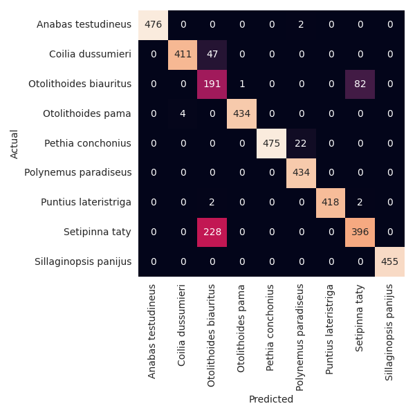
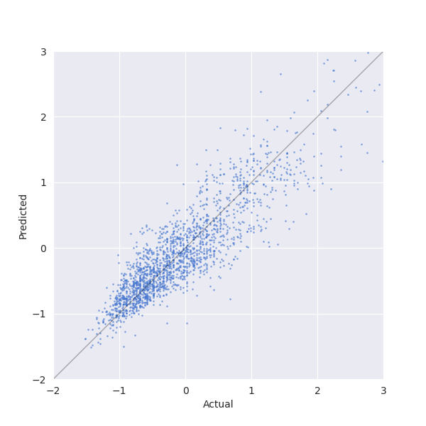

+++
title = 'Neural Networks'
date = 2024-11-06T13:22:54+11:00
math = true
draft = false
tags = ["machine-learning", "neural-networks", "python"]
+++

I'm filling in some gaps from my masters and one of the side-quests
that I never completed was coding up a neural network from scratch. 
These models have the reputation of being a 'black box' where
data goes in and predictions magically come out. Building one up 
takes away this feeling and reminds you that they're just a clever 
system of linear algebra cogs.

This post develops a single hidden layer perceptron in OOP style. 
It is obviously not supposed to be very good, but three demonstrations 
after the model class show that it definitely works.


Some ideas for extensions one day:
- Everything happens by-sample. By-batch is better and should 
just be some matrix multiplication.
- Multiple hidden layers, with different activation functions.
- Stochastic gradient descent.
- Momentum in gradient descent?
- Regularization.


## Imports and configuration
Nothing very exciting here, except maybe `autograd`. The back-propagation 
algorithm used the derivative of the activation functions on each layer.
We could hardcode $\tanh$ and its derivative $1 - \tanh^2$ but it's not
complicated to the activations as parameters and let `autograd` find the 
derivatives.


```python
import autograd.numpy as np
from autograd import elementwise_grad as egrad
import seaborn as sns
import matplotlib.pyplot as plt
import pandas as pd
import os
import time
from sklearn.datasets import load_breast_cancer
from sklearn.metrics import log_loss, mean_squared_error
from typing import Callable, Optional

sns.set_palette("muted")
colors = sns.color_palette()
sns.set_style("darkgrid")
plt.rcParams["figure.facecolor"] = "none"
plt.rcParams["figure.edgecolor"] = "none"
plt.rcParams["figure.figsize"] = (4, 4)
```


## Activation functions
These are the activation functions that are used in the examples that follow
the main code, along with $\tanh$ which is imported from `numpy`.
The modification to `softmax` was the computer's suggestion and is apparently
useful for avoiding over/underflow errors.


```python
def sigmoid(z):
    return 1 / (1 + np.exp(-z))


def softmax(x):
    exp_x = np.exp(x - np.max(x))  # Subtract max for numerical stability
    return exp_x / exp_x.sum()
```


## Model
The `Model` class starts with a basic constructor that just records
the parameters it receives and takes a few derivatives.

```python
class Model:

    def __init__(
        self,
        hidden_size: int,
        learning_rate: float = 0.01,
        batch_size: int = 32,
        hidden_activation: Callable = np.tanh,
        output_activation: Callable = sigmoid,
        scoring: Optional[Callable] = None,
    ):
        """Initialize neural network model.

        Args:
            hidden_size: Number of neurons in hidden layer
            learning_rate: Learning rate for gradient descent
            batch_size: Number of samples per batch
            hidden_activation: Activation function for hidden layer
            output_activation: Activation function for output layer
            scoring: Optional scoring function for tracking progress
        """
        self.hidden_size = hidden_size
        self.lr = learning_rate
        self.batch_size = batch_size
        self.scoring = scoring
        self.hidden_activation = hidden_activation
        self.hidden_activation_grad = egrad(hidden_activation)
        self.output_activation = output_activation
        self.output_activation_grad = egrad(output_activation)
```


## Initialise Weights
When the model is fitted, it will infer the input and output shapes
from the training data. Then it can set up the arrays/vectors that 
hold the weights and biases.
```python
    ...
    def init_weights_and_biases(self, x, y):
        """
        Initialize weights and biases with small random numbers.
        """
        input_size = x.shape[1]
        hidden_size = self.hidden_size
        output_size = 1 if len(y.shape) == 1 else y.shape[1]
        rand = lambda dims: np.random.randn(*dims) / 100
        self.w1 = rand((hidden_size, input_size))
        self.b1 = rand((hidden_size,))
        self.w2 = rand((output_size, hidden_size))
        self.b2 = rand((output_size,))
```
## Forward Pass
This is relatively straightforward, computing weighted inputs and
activations in the hidden and output layers.
```python
    ...
    def forward(self, x):
        """
        Forward pass through the network.
        """
        self.z1 = self.w1 @ x + self.b1
        self.a1 = self.hidden_activation(self.z1)
        self.z2 = self.w2 @ self.a1 + self.b2
        self.a2 = self.output_activation(self.z2)
```


## Backward Pass
This is more complicated. 
Using the quadratic loss, the error in the output layer is given by
$$\delta^2 = (a^2 - y) \odot \sigma_2^{'}(z^2)$$ and the error in the hidden 
layer by 
$$\delta^1 = w^{2T}d^2 \odot \sigma_1^{'}(z^1)$$

These errors are calculated and used to evaluate the gradient of the loss
function with respect to the weights and biases.
Note that this is for a single observation $(x_i, y_i)$.

```python
    ...
    def backward(self, xi, yi):
        """
        Backward pass through the network.
        """
        if self.output_activation == softmax:
            d2 = self.a2 - yi
        else:
            d2 = (self.a2 - yi) * self.output_activation_grad(self.z2)

        d1 = (self.w2.T @ d2) * self.hidden_activation_grad(self.z1)
        # Gradient of loss wrt w1, b1, w2, b2
        self.cost_gradients = [d1, xi * d1[:, None], d2, self.a1 * d2[:, None]]
```

## Run a Batch
We can now run the algorithm for a batch of $(x_i, y_i)$ pairs.
Using iteration is definitely not the 'right' way to do this, since
the strength of the algorithm is that it can be implemented using lots
of (fast) matrix multiplications. I have found that this version is easy
to read and so will leave this optimisation for another day.

This function has three steps:
1. For each $(x_i, y_i)$ pair, compute the gradient of the cost function 
with respect to the parameter groups $b_1, w_1, b_2, w_2$.
2. Stack all the $b_1$ values into an array, all the $w_1$ values into 
another array etc. 
3. Take the mean of each of these arrays and use it to perform a gradient 
descent of the parameters.

This is not very clear and could definitely be improved. 

```python
    ...
    def batch(self, x, y):
        grads = []
        for xi, yi in zip(x, y):
            self.forward(xi)
            self.backward(xi, yi)
            grads.append(self.cost_gradients)
        grads = [np.stack(g, axis=0) for g in list(zip(*grads))]
        db1, dw1, db2, dw2 = [a.mean(axis=0) for a in grads]

        # Gradient descent.
        self.b1 -= self.lr * db1
        self.w1 -= self.lr * dw1
        self.b2 -= self.lr * db2
        self.w2 -= self.lr * dw2
```


## Epoch
Training for one epoch is achieved here by splitting the provided data 
into a number of batches (that number being a model hyper-parameter) 
and calling the function above on each batch.

```python
    ...
    def run_epoch(self, x, y):
        for i in range(0, len(x), self.batch_size):
            batch_x = x[i : i + self.batch_size]
            batch_y = y[i : i + self.batch_size]
            self.batch(batch_x, batch_y)
```


## Fit

Finally to fit a model, you simply run call `run_epoch` however many
times you need. There are a few extras, like allowing `pandas` input 
and recording a scoring metric as training happens but essentially this
is just repeating `run_batch`.


```python
    ...
    def fit(self, x, y, n_epochs=100):
        if isinstance(x, pd.DataFrame):
            x = x.values
        if isinstance(y, pd.DataFrame) or isinstance(y, pd.Series):
            y = y.values
        if len(y.shape) == 1:
            y = y.reshape(-1, 1)
        self.init_weights_and_biases(x, y)
        history = []
        start_time = time.time()
        for epoch in range(n_epochs):
            self.run_epoch(x, y)
            if self.scoring:
                history.append(self.scoring(y, self.predict(x)))
                elapsed = time.time() - start_time
                print(
                    f"Epoch {epoch:>3d}  |  Loss: {history[-1]:.4f}  |  Time: {elapsed:.1f}s"
                )
            else:
                print(f"Epoch {epoch:>3d}  |  Time: {elapsed:.1f}s")
        return history or None
```

## Making Predictions
This is nothing more than making a forward pass through the network
using supplied data and collection the output layer.


```python
    ...
    def predict_one(self, xi):
        self.forward(xi)
        return self.a2

    def predict(self, x):
        if isinstance(x, pd.DataFrame):
            x = x.values
        predictions = np.array([self.predict_one(xi) for xi in x])
        if predictions.shape[1] == 1:
            predictions = predictions.reshape(-1)
        return predictions
```


## Example: Binary Classification
The first example tries to determine the malignancy of breast cancers.
This dataset is known to be an easy binary classification problem and
is a good one to start with, since there are only 569 rows and we will
know quickly if it is working or not. For simplicity only 6 of the available
inputs are selected. The model has three hidden neurons and an appropriate 
activation for binary classification.

```python
    ...
x, y = load_breast_cancer(as_frame=True, return_X_y=True)
x = x[
    [
        "mean radius",
        "mean texture",
        "mean perimeter",
        "worst radius",
        "worst texture",
        "worst perimeter",
    ]
]
x = (x - x.mean(axis=0)) / x.std(axis=0)

m = Model(
    hidden_size=3,
    learning_rate=0.05,
    batch_size=32,
    hidden_activation=np.tanh,
    output_activation=sigmoid,
    scoring=log_loss,
)

history = m.fit(x, y, n_epochs=50)

yhat = m.predict(x)
print(f"Accuracy: {np.mean(y == (yhat > 0.5)):.2%}")
correct = y == (yhat > 0.5)
correct = np.where(correct, "Correct", "Incorrect")

fig, axs = plt.subplots(ncols=2, figsize=(8, 4))
axs[0].plot(history)
axs[0].set(title="Training loss", xlabel="Epoch", ylabel="Loss")
sns.scatterplot(x=range(len(yhat)), y=yhat, hue=correct, style=correct, s=20)
axs[1].legend(loc="center right")
axs[1].set(title="Hit or Miss", xlabel="Index", ylabel="Prediction")
plt.tight_layout()
plt.show()
plt.savefig(os.path.join("out", "breast_cancer_classification.svg"))
```

Below we can see the training loss decreasing nicely and a good separation 
between the two classes. After 50 epochs this model achieves an accuracy of 
93%. This is not impressive for this dataset but it works!
<div align="center">



</div>


## Example: Multiclass Classification

The model can also handle a multiclass classification problem, 
with the only change needed being the output activation which 
is a `softmax` here in place of the earlier `sigmoid`.
The problem now is to use the length, width and ratio of these
to try and classify a fish.


```python
df = pd.read_csv(os.path.join("data", "fish_data.csv"))
df = df.sample(frac=1, random_state=42).reset_index(drop=True)
x, y = df.drop(columns=["species"]), df["species"]
y = pd.get_dummies(y)
x = (x - x.mean(axis=0)) / x.std(axis=0)

m = Model(
    hidden_size=16,
    learning_rate=0.01,
    batch_size=32,
    hidden_activation=np.tanh,
    output_activation=softmax,
    scoring=log_loss,
)

history = m.fit(x, y, n_epochs=50)

yhat = np.argmax(m.predict(x), axis=1)
yv = np.argmax(y, axis=1)
print(f"Accuracy: {np.mean(yhat == yv):.2%}")

fig, ax = plt.subplots()
sns.heatmap(pd.crosstab(yhat, yv), annot=True, fmt="d", cbar=False, ax=ax)
ax.set(xlabel="Predicted", ylabel="Actual")
# Use the column names from x as labels.
ax.set_xticklabels(y.columns, rotation=90)
ax.set_yticklabels(y.columns, rotation=0)
# plt.show()
plt.savefig(os.path.join("out", "fish_classification.png"))
```
In the following confusion matrix we can see that most species 
are correctly classified, with the exception of *Setipinna taty* which is 
misclassified as  *Otolithoides biauritus* half the time.

<div align="center">



</div>


## Example: Regression
Lastly we will try and predict the value of a car, knowing the
year, mileage, miles-per-gallon and engine size.
This dataset is a lot larger than the other two, so we only train for
5 epochs but we can still get reasonable results, enough to believe 
that the model is healthy anyway.
The appropriate activation here is the identity function.


```python
df = pd.read_csv(os.path.join("data", "CarsData.csv"))
df = df.sample(frac=1, random_state=42).reset_index(drop=True)
x = df[["year", "mileage", "mpg", "engineSize"]]
x = (x - x.mean(axis=0)) / x.std(axis=0)
y = (df["price"] - df["price"].mean()) / df["price"].std()

m = Model(
    hidden_size=6,
    learning_rate=0.05,
    batch_size=128,
    output_activation=lambda x: x,
    scoring=mean_squared_error,
)

history = m.fit(x, y, n_epochs=5)

indices = np.random.choice(len(x), 2000)
x_sample = x.iloc[indices]
y_sample = y[indices]
y_hat_sample = m.predict(x_sample)

fig, ax = plt.subplots()
ax.scatter(y_sample, y_hat_sample, label="Predicted", s=1, alpha=0.5)
ax.set(xlabel="Actual", ylabel="Predicted", xlim=(-2, 3), ylim=(-2, 3))
# Add the diagonal line.
ax.plot([-2, 3], [-2, 3], color="black", lw=1, alpha=0.3)
# plt.show()
plt.savefig(os.path.join("out", "cars_regression.png"))
```


We can see that points in the predicted vs actual price scatterplot
are clustered around the diagonal, implying the model has a degree of 
understanding of the problem.


<div align="center">



</div>


## Conclusion
In this post we built a neural network with a single hidden network. 
It's built for friendliness not speed, but it works. 
By changing the activation function on the output layer the model can 
be used for binary/multiclass classification and regression problems.

The next thing I would try is to vectorise the operations inside the
training loop, not because this would be more performant (although it
would) but rather because I think it would actually be easier to read.
Another avenue would be to do this again without OOP. The model doesn't
interact with any other objects, its mostly a container for all its 
methods.

All in all though this has been a hard but rewarding project and I do 
feel like I understand the back-propagation algorithm a lot better.


## References:
  - http://neuralnetworksanddeeplearning.com/chap2.html
