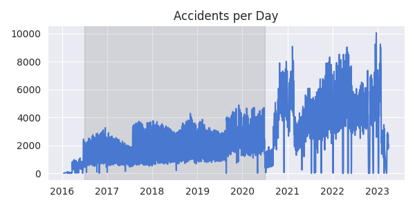

+++
title = 'Car Accidents in the USA (WIP)'
date = 2024-11-15T15:56:01+11:00
draft = false
leaflet = true
deckgl = true
tags = ["sql", "postgresql", "python", "sedona", "docker"]
+++

Source: 
[https://github.com/hlud6646/us-accidents](https://github.com/hlud6646/us-accidents)
 
An interviewer asked me 'What kind of exposure to SQL have you had?'
and I felt that my answer of 'one uni subject and some hacker-rank 
practice problems' was insufficient. Next time I will tell them about
this.

I wanted to do something more interesting than 'load a database, do some
queries' and have gone into territory where SQL might not be the first
thing you think of. Essentially this project is a large geospatial 
analysis of car crashes, with lots of visualisations. SQL enters 
the picture via the interface for querying the data, although in the 
end it is not through a database per se, but rather the SQL interface of 
an RDD in Apache Spark.

*Why not keep it simple and actually use a database?* I find it 
hard to find motivating practice projects in SQL. While I do begin with
an example ETL pipeline, to do interesting
work I switch to a docker instance running Apache-Sedona. This way I get
to learn a bit about docker and brush up on distributed computing too. 


## The Data
The idea for this came from a popular Kaggle dataset on **US Accidents**.
This contains the location, time and several descriptive features of car 
accidents in the contiguous United States in the years from 2016 to 2023.
There are a lot, which is good because it makes you think properly about 
the ETL process. The data are contained in one large csv file.

Data for state and county lines in the US is available at cencus.gov.
These are in shapefiles.

Lastly, another dataset on Kaggle provides detailed data from the 2015 and 2017 censuses.
If this was something more than an educational project I would worry more about the 
provenance of the Kaggle datasets and try to rebuild them from official sources. For 
these purposes they should be fine.


## DB Admin

I did actually start with a regular PostgreSQL database. This project is supposed to 
demonstrate SQL, so even if the maps are drawn somewhere else in the end, I'm 
pleased to have followed the database admin steps through. These will be
- Create admin and normal roles for the project;
- Create a database and configure permissions.

For a project like this with a single contributor (me) it is overkill to have 
different roles. In the real world it's hugely important to give everybody only
the minimal set of permissions necessary for them to do their job. So to continue with 
the exercise in mock administration,  run the following commands in a `psql` 
console as a user with the `Create role` and `Create DB` attributes.
All these commands are pretty obvious, except maybe 'alter default...'. These
simply say that the intern should get read and write access for any tables 
that admin creates (this is a bit heavy-handed but you get the idea), while 
admin gets full access to any tables that the intern creates.


```sql
create user us_accidents_admin with encrypted password 'bigsecret';
create user us_accidents_intern with encrypted password 'password42';
create database us_accidents;
grant all privileges on database us_accidents to us_accidents_admin;
alter database us_accidents owner to us_accidents_admin;
-- Switch to a new connection on the us_accidents database now.
alter default privileges
    for role us_accidents_admin
    in schema public
    grant select, insert on tables to us_accidents_intern;
alter default privileges
    for role us_accidents_intern
    in schema public
    grant all privileges on tables to us_accidents_admin;
grant connect on database us_accidents to us_accidents_intern;
grant usage, create on schema public to us_accidents_intern;
```

The following sequence verifies that the permissions are
configured correctly:

```sql
 (admin)# create table demo(foo integer, bar varchar(40));
 (admin)# insert into demo values(123, 'Hi!');
(intern)# insert into demo values(456, 'Bon Jour!');
(intern)# select * from demo;
(intern)# truncate demo; -- Fails.
(intern)# create table demo2(foop integer, barp varchar(40));
(intern)# insert into demo2 values(987, 'hihihi');
 (admin)# select * from demo2;
 (admin)# drop table demo;
 (admin)# drop table demo2;
```

## ETL
<!-- Source code? -->

The next part is propagating the database with the contents of the files discussed above.
Starting with the raw data on accidents, the goal is to get a table like this:

|   severity | datetime            |     lat |      lng | weather_condition   |   city_id |
|-----------:|:--------------------|--------:|---------:|:--------------------|----------:|
|          3 | 2016-02-08 05:46:00 | 39.8651 | -84.0587 | Light Rain          |       811 |
|          2 | 2016-02-08 06:07:59 | 39.9281 | -82.8312 | Light Rain          |     11613 |
|          2 | 2016-02-08 06:49:27 | 39.0631 | -84.0326 | Overcast            |     17241 |


The accidents are in CSV format, and it is definitely possible to read this directly into 
a database. In fact the fastest way to load data is like this. In this case though there 
are many columns that we don't want, and there is some preprocessing to do first, which 
while possible in SQL, is much easier in a language like Python.


### Extract
The file is around 3G,
which would comfortably fit inside RAM on this machine, but this is also an opportunity to
develop a process for working with larger than memory datasets. The state of the art (in Python 
or Rust at least) is the `Polars` library, which is similar in some ways to the more well 
known `Pandas` but with the option to be *lazy*. Essentially this means that when you load
a file into a dataframe, almost nothing happens. When you manipulate it, again nothing really
happens. What *does* happen in both cases is that a computation plan is created, which can 
be optimised as further manipulation steps are added. When you call a special method called 
`collect` this computation is actually run.


Moving to the actual data, some of the 40 or so recorded features are
- ID
- Source
- **Severity**
- **Start_Time**
- End_Time
- **Start_Lat**
- **Start_Lng**
- End_Lat
- End_Lng
- Distance(mi)
- Description
- Street
- **City**
- **County**
- **State**
- Zipcode
- Country
- Timezone
- Airport_Code
- **Weather Condition**
- ...

The rest are descriptions of the accident site and have lots of null values.
From the list above we will keep the features marked in bold. We can (lazily)
load the data and extract these columns as follows. Note that `polars` can handle
the tedious task of parsing dates for us.

```python
df = pl.scan_csv("data/US_Accidents_March23.csv", try_parse_dates=True)

df = df.select(
    # pl.col("ID"),
    pl.col("Severity").alias('severity'),
    pl.col("Start_Time").alias('datetime'),
    pl.col("Start_Lat").alias('lat'),
    pl.col("Start_Lng").alias('lng'),
    pl.col("Weather_Condition").alias('weather_condition'),
    pl.col("City"),
    pl.col("State"),
    pl.col("County")
)
```

We have a dataframe like

|   severity | datetime            |     lat |      lng | weather_condition   | City         | State   | County     |
|-----------:|:--------------------|--------:|---------:|:--------------------|:-------------|:--------|:-----------|
|          3 | 2016-02-08 05:46:00 | 39.8651 | -84.0587 | Light Rain          | Dayton       | OH      | Montgomery |
|          2 | 2016-02-08 06:07:59 | 39.9281 | -82.8312 | Light Rain          | Reynoldsburg | OH      | Franklin   |
|          2 | 2016-02-08 06:49:27 | 39.0631 | -84.0326 | Overcast            | Williamsburg | OH      | Clermont   |

and if we inspect the schema with `df.collect_schema()` we find that polars 
has read the numeric types and dates correctly.


### Transform

Next we want to compress the city/state/county fields to a 'city_id' (imagine we are constrained by
disk size or that the manager wants the database normalised).
Recording the city alone is not enough, since there are at least 31 cities called 'Washington' in
the continental US.
Creating a key based on the city and county name is not enough, since there are at least four 
states that have a city called 'Carrollton' in a county called 'Carroll'.
And creating a key based on city and state doesn't work either, since there are at least seven 
cities in Virginia called 'Fredericksburg'.

So we need a key based on all three of city, county and state.
In polars we can select unique combinations of these three attributes and create
an artificial key as follows:
```python
cities_df = df.select(
    pl.col('City'),
    pl.col('State'),
    pl.col('County')
).unique().with_row_index(name='city_id')
```

This is still just a computation plan, so to execute it (and print the markdown below)
you need to do something like
```python
print(cities_df.head().collect().to_pandas().to_markdown(index=False))
```

Our cities frame now looks like 

|   city_id | City        | State   | County     |
|----------:|:------------|:--------|:-----------|
|         0 | Tolland     | CT      | Capitol    |
|         1 | Blakely     | GA      | Early      |
|         2 | Luling      | LA      | St Charles |
|         3 | Lewisburg   | KY      | Logan      |
|         4 | Clintondale | NY      | Ulster     |


and all that's left to do is to replace City/State/County in 
the original dataframe by the new city_id, by joining this new
table and then excluding the unwanted features:

```python
df = (
    df.join(
        cities_df,
        on=['City', 'County', 'State'], 
        how='left'
    )
    .select(pl.exclude(['City', 'County', 'State']))
)
```


### Load
We now have our final table of accidents data:

|   severity | datetime            |     lat |      lng | weather_condition   |   city_id |
|-----------:|:--------------------|--------:|---------:|:--------------------|----------:|
|          3 | 2016-02-08 05:46:00 | 39.8651 | -84.0587 | Light Rain          |     23376 |
|          2 | 2016-02-08 06:07:59 | 39.9281 | -82.8312 | Light Rain          |       559 |
|          2 | 2016-02-08 06:49:27 | 39.0631 | -84.0326 | Overcast            |      5086 |


and can write it (and the cities dataframe) to the database. 
Polars has a very convenient method for this,
allowing you to create and populate a database in a single line:

```python
df.collect().write_database(table_name='accidents', connection=DB_URI)
cities_df.collect().write_database(table_name="cities", connection=DB_URI)
```

Since the cities table is derived from the accidents table, any data integrity
constraints that we might require are guaranteed to hold. It's a good idea to 
enforce them anyway, if we imagine that the schema will become more complex
as we add other data sources. The constraint to consider here is that the 
city_id for an accident record must correspond to a row in the cities table.
The sql to achieve this is like 

```sql
alter table cities
add constraint unique_city_id
unique (city_id);

alter table accidents
add constraint fK_accidents_city_id
foreign key (city_id) references cities(city_id);
```

For a quick test lets count the number of accidents per day in December 2020:
```sql
select count(*) as count, extract(day from datetime) as day
from accidents
where extract(month from datetime) = 12
  and extract(year from datetime) = 2020
group by day
order by count desc
limit 4;
```
| count | day |
| :--- | :--- |
| 8013 | 23 |
| 7763 | 24 |
| 7497 | 17 |
| 7350 | 30 |

from which we can see that lots of Americans crash their cars in the days before 
Christmas, possibly because more of them are driving longer distances.


## EDA
Having done all of that, we will now actually not use it at all and turn to a 
different analytics solution.
The point of this project was to demonstrate SQL, so the excursion into Docker
and Apache-Sedona isn't given quite as much air time as the discussion above.

### Setup

The easiest way to experiment with apache products is via their official 
container images. The following command will (pull and) launch an an ubuntu
instance with apache-sedona ready to use. It will take 2GB memory for the driver
and executor each and expose a few ports so that we can interact with it.

```sh
docker run -e DRIVER_MEM=2g -e EXECUTOR_MEM=2g -p 8888:8888 -p 8080:8080 -p 8081:8081 -p 4040:4040 apache/sedona
```

Find the container id with something like `docker ps | grep sedona` and then copy the data
to the instance with `docker cp <path to data> <instance id>:/opt/workspace/data`.
We can now interact with the instance via the exposed port at http://localhost:8888/lab.

### Spark
The plan is to analyse the accidents data with apache-spark.
Because the data is geospatial in nature (accidents take place at a definite location)
the tool will be apache sedona, which add extra functionality to base spark.  Very often
the results of a query are converted to a Pandas dataframe. This begs the question
"Why not just use Pandas from the start?", which is probably fair in this case. 
For larger datasets and more complex queries though the whole point of apache-spark 
is that you can distribute both the data and the processing across a cluster of machines.
Dropping the *result* of your query into Pandas and working in that library just for plotting
is a reasonable workflow.


This note is supposed to be about SQL primarily, so I will not dwell on configuring spark/sedona
or loading the data in. All of that can be found in the source code linked at the start.
First we should repeat the sanity check from earlier. As we go, we'll keep a close eye
on what SQL operations are permitted in the Spark interface. Here we have **column aliasing**, 
**grouping and aggregation**, **timestamp manipulation** and **ordering**.

```python
print(sedona.sql("""
    select count(*)                     as count,
           extract(day from start_time) as day
    from accidents
    where extract(month from start_time) = 12
      and extract(year from start_time) = 2020
    group by day
    order by count desc
    limit 4;
""").show()

# +-----+---+
# |count|day|
# +-----+---+
# | 8013| 23|
# | 7763| 24|
# | 7497| 17|
# | 7350| 30|
# +-----+---+
```


### A First Look
The simplest visualisation I can think of with this data would be the number of accidents per day:
```python
tmp = sedona.sql("""
    select count(*)                      as count,
           date_trunc('day', start_time) as date
    from accidents
    group by date;
""").toPandas().set_index("date")

fig, ax = plt.subplots(figsize=(6, 3))
sns.lineplot(tmp, legend=False, ax=ax)
ax.set(xlabel="", title="Accidents per Day");
ax.axvspan("2016-07-01", "2020-06-30", alpha=0.1, color="black");
```





Clearly the data is very noisy, and for whatever reason is not good outsite the shaded region.
The following plot shows that the noise is at least partly due to a weekend/weekday effect on 
the number of accidents. Note that from now on only the sql queries will be shown in code 
boxes. 

This project is supposed to be about SQL, 
and so from now on the codeboxes will only show the SQL queries that are passed
to the `sedona.sql` function.  Also omitted is code for plots, but it's all available 
in the notebook in the source code.

```sql
-- Find the total number of accidents. Store the result in a python 
-- object called total_accidents.
select count(*)
from accidents
where start_time between "2016-07-01" and "2020-06-30";

-- Because the sql is passed as text to a python function, we can 
-- use string interpolation to include the output of the previous query.
select count(*)                                     as count,
       round(count(*) / {total_accidents} * 100, 1) as proportion,
       extract(dow from start_time)                 as dow
from accidents
where start_time between "2016-07-01" and "2020-06-30"
group by dow
order by dow;
```


Many SQL engines will allow you to bind the result of a select expression to a variable
which can be used in subsequent queries. Spark does not allow this, which is why we had to 
perform the calculation above in two stages. In fact we could substitute the whole expression 
that finds the total_accidents into the second computation, but that would make it a bit hard
to read. It is worth being aware of the fact that running two separate computations diminishes 
the opportunity for the spark engine to optimise the queries.

Any time we see string interpolation in an SQL query we should hear alarm bells ringing.
This is one of the most basic security vulnerabilities (https://xkcd.com/327/) but it is 
safe here, since we defined the replacement value ourselves with no input from outside.

To recap on concepts introduced here, we have **filtering results**, **proportions**,
**variable binding**, **injection attacks**.

The last plot in this part is this part is an attempt to isolate the yearly seasonality of 
accidents. If we look at the three complete years in the shaded part above, namely
2018, 2018 and 2019, we can form a time plot of the number of accidents each day of the
year.  We can then take the mean of all three, to hopefully smooth the line somewhat. 
We can also overlay a moving average of the last 20 observations. It appears that Americans
crash more in Winter.


Note that the sql query to find a **moving average** of a time series -  which is itself 
an averate of three time series - requires a **doubly nested subquery**.

```sql
select doy,
       accidents,
       avg(accidents) over (order by doy rows between 20 preceding and current row) as moving_average
from (select doy,
             avg(count) as accidents
      from (-- this query will select the number of accidents per day, for each day of the year and each year.
               select count(*)                     as count,
                      datepart('doy', start_time)  as doy,
                      datepart('year', start_time) as year
               from accidents
               group by doy, year)
      group by doy)
order by doy
```


### Normalising by Population
If we are looking for variance in the number of accidents by county, it well 
help to normalize by population for the county first.
If we do this we see that while Harris county has the most accidents in absolute terms, 
that is because it is by far the most populous county.
Travis county is ~1/6 the siz and yet it still has 5 times more accidents than Harris
on a per capita basis:

|    | geometry   | county   |   accidents | population   |   Ap100k |
|---:|:-----------|:---------|------------:|:-------------|---------:|
|  0 | ...        | Travis   |       68672 | 1121.6k      |  6122.44 |
|  1 | ...        | Bexar    |       24706 | 1825.5k      |  1353.38 |
|  2 | ...        | Harris   |      106975 | 8712.7k      |  1227.8  |
|  3 | ...        | Tarrant  |       17456 | 1914.5k      |   911.77 |

The query here is

```sql
 select c.geometry,
    c.name as county,
    ifnull(a.count, 0) as accidents,
    cast(round(cencus.population / 1000, 1) as string) || "k" as population,
    -- Accidends Per 100 K
    round(accidents / cencus.population * 100000, 2) as Ap100k from counties c
left outer join (
    select count(*) as count,
        county
    from accidents a
    where a.state_code = 'TX'
        and start_time between "2016-07-01" and "2020-06-30"
    group by a.county) a
on c.name = a.county
right outer join (
    select County, 
        sum(TotalPop) as population 
    from cencus
    left outer join counties c
        on County = c.name
    where State = 'Texas'
    group by County 
) cencus
on c.name = cencus.County
where c.STUSPS = 'TX'
order by Ap100k desc
```

It is important to use a **left join** in this query to capture all the counties, 
including those for which no accidents have been recorded.

## Summary
This project started with creating and populating a postgresql database with data from 
some csv and shapefiles.
Following that we moved to an Apache Spark environment, where we used the SQL interface
into dataframes. We observed a few seasonal trends in the data and noticed that Travis 
county is a good place to own a smash repair shop.

## References

- Sobhan Moosavi. (2023). US Accidents (2016 - 2023) [Data set]. Kaggle. https://doi.org/10.34740/Kaggle/DS/199387
- US Census Bureau. (2024, October 30). Cartographic Boundary Files - Shapefile. Census.gov. https://www.census.gov/geographies/mapping-files/time-series/geo/carto-boundary-file.html
- US Census demographic data. (2019, March 3). Kaggle. https://www.Kaggle.com/datasets/muonneutrino/us-census-demographic-data
- https://earthobservatory.nasa.gov/blogs/elegantfigures/2013/08/05/subtleties-of-color-part-1-of-6/


<!-- This project will demonstrate -->
<!-- - Database administration (creating a database, creating users with -->
<!-- appropriate permissions, integrity constraints); --> 
<!-- - ETL pipeline for larger than memory datasets; -->
<!-- - Geospatial analysis and visualisation. -->

<!-- Tools used include **PostgreSQL**, **Python (Polars)**, **Apache Sedona**. -->
