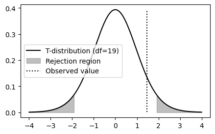

+++
title = '01 -  One Sample t-Test'
date = 2025-07-19T12:02:29+10:00
draft = true
math = true
+++

*Is the mean of this group what I think it is?*

**Null Hypothesis:** The population mean is $\mu_0$.  
**Alternative Hypothesis:** It is some other value.

Contents:
1. t-test implementation;
1. t-test example;
1. Verification against library function;
1. Monte Carlo simulation of type I error rate;
1. Comparison of t-distribution with standard normal


```python
import numpy as np
import scipy.stats as stats
import matplotlib.pyplot as plt
plt.rcParams["figure.facecolor"] = (0, 0, 0, 0)
plt.rcParams["figure.edgecolor"] = (0, 0, 0, 0)
plt.rcParams["figure.figsize"] = (5, 3)


def make_data(true_mean):
    """Return a univariate dataset of 20 samples around a given mean."""
    return np.random.normal(loc=true_mean, size=20)

def t_observed(data: np.array, mu0):
    """Calculate the observed t-statistic given observed data and hypothesised value of the 
    population mean."""
    x_bar = data.mean()
    s     = data.var(ddof=1)
    n     = len(data)
    return (x_bar - mu0) / (s**.5 / n**.5)

def plot_t_test(dof, critical_value, t_observed):
    x = np.linspace(-4, 4, 1000)
    plt.plot(x, stats.t.pdf(x, df=dof), label=f'T-distribution (df={dof})', color="black")
    x_fill = np.linspace(critical_value, 4, 100)
    y_fill = stats.t.pdf(x_fill, df=dof)
    plt.fill_between(x_fill, y_fill, color='gray', alpha=0.5, label="Rejection region")
    x_fill = np.linspace(-critical_value, -4, 100)
    y_fill = stats.t.pdf(x_fill, df=dof)
    plt.fill_between(x_fill, y_fill, color='gray', alpha=0.5)
    plt.axvline(t_observed, ymin=0.05, ymax=0.95, color='black', linestyle=':', label="Observed value")
    plt.legend(loc="center left")
    plt.show()

def t_test(data: np.array, proposed_mean, alpha):
    """Report the observed value of the test statistic and associated p-value for 
    the given data, significance level and hypothesised population mean."""
    t_obs    = t_observed(data, proposed_mean)
    dof      = len(data) - 1
    t_dist   = stats.t(df=dof)
    p_value  = 2 * t_dist.sf(np.abs(t_obs))
    crit_val = stats.t.ppf(1 - alpha / 2, df=dof)
    
    plot_t_test(dof, crit_val, t_obs)
    return t_obs, p_value
```

# Running a Test
The next cell creates a dataset centered at $4.3$ and runs the test against the hypothesis that 
the true mean is $4$. As always, we used domain specific knowledge to choose the significance 
level of $\alpha = 0.07$.  Since the observed value of the test statistic is not as extreme as
the critical value, we cannot reject the null hypothesis. Our data do not suggest that the true
mean is different from $4$.

Notes: 
- We do not say "Our data suggest the true mean is $4$".
- This is the case even though we *know* that the true mean is different from $4$.


```python
np.random.seed(123)
data = make_data(true_mean=4.3)
t_test(data, proposed_mean=4, alpha=0.07)
```


    
 
    


    (np.float64(1.4738784738034707), np.float64(0.15689030687628713))


## Comparison With Library Function
The `scipy.stats` library provides this exact test.
We can run it and confirm that our implementation is correct.


```python
stats.ttest_1samp(data, popmean=4)
```


    TtestResult(statistic=np.float64(1.4738784738034707), pvalue=np.float64(0.15689030687628713), df=np.int64(19))


## Rejection Rate
We chose $0.07$ as the significance level in our experiment. This means that we should expect the 
test to incorrectly reject the null $7\%$ of the time. That is, if we hypothesise the *correct* 
population mean, and redraw our sample many times, the test will tell us that the hypothesis was
not correct in $7\%$ of the draws. 


```python
def rejection_rate():
    alpha = 0.07
    true_mean = 4
    runs = []
    for _ in range(10000):
        data = make_data(true_mean)
        test_result = stats.ttest_1samp(data, popmean=true_mean)
        runs.append(test_result.pvalue < alpha) 
    return np.mean(runs)

rejection_rate()
```


    np.float64(0.0708)


```python
# Notice that the test uses a normal approximation to the t-distribution.
# Look how close they are:

fix, axs = plt.subplots(ncols=4, figsize=(12, 4))
dof = [3, 5, 10, 20]
for ax, dof in zip(axs, dof):
    x = np.linspace(-4, 4, 1000)
    t_dist = stats.t(df=dof)
    ax.plot(x, t_dist.pdf(x), label=f'T-distribution (df={dof})')
    ax.plot(x, stats.norm.pdf(x, 0, 1), label='Standard Normal', linestyle=':')
    if dof == 20:
        ax.legend()
    ax.set_title(f'T-distribution (df={dof})')

plt.tight_layout()
```


```python

```
